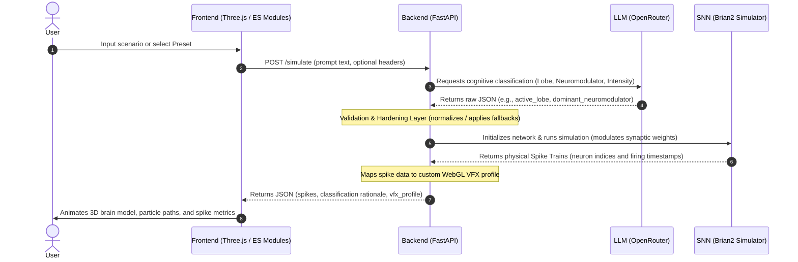

# CogniGraph

<p align="center">
  
</p>

**CogniGraph** is an interactive, educational 3D brain simulation platform that bridges natural language, spiking neural networks, and GPU-accelerated graphics. Users input a real-world scenario (e.g., "studying for a final exam" or "drinking a double espresso"), and the system classifies the corresponding cognitive/neuromodulatory state using a Large Language Model (LLM), simulates biologically plausible neural dynamics using a Spiking Neural Network (SNN), and visualizes the resulting spike trains in real-time on an interactive 3D brain model.

### ▶️ [Try the live demo → cognigraph-13906.fly.dev](https://cognigraph-13906.fly.dev/)

No install needed — type a scenario and watch the 3D brain respond.

---

> [!WARNING]
> **IMPORTANT: NON-MEDICAL & EDUCATIONAL DISCLAIMER**
>
> **CogniGraph is strictly an educational tool and simulation metaphor. It is not medical software.**
> - The outputs, classifications, and visualizations generated by this platform are for educational and learning purposes only.
> - They must **not** be used for clinical diagnosis, treatment, prevention, or medical decision-making.
> - The simulated stress axes (such as the HPA axis and cortisol levels) are simplified mathematical metaphors, not clinical measurements. For instance, the cortisol `neuromodulator_intensity` controls an acute optimal vs. chronic-load simulation regime (threshold at 0.5) to alter network dynamics, not an actual physiological hormone concentration.

---

## 🚀 Key Features

*   **Natural Language Cognitive Classifier**: Translates subjective user descriptions into neuro-computational parameters (target brain lobe and neuromodulator tone) via OpenRouter LLM endpoints.
*   **Biologically Plausible Spiking Neural Network (SNN)**: Simulates real-time dynamics with the [Brian2](https://brian2.readthedocs.io/) simulator, applying neuromodulatory shifts to synaptic weights, time constants, and firing thresholds.
*   **GPU-Accelerated 3D WebGL Visualization**: Renders interactive, real-time spike trains, glowing lobe regions, and custom bloom/bloom-pass VFX overlays directly on a 3D brain model using Three.js.
*   **Hardened Validation Layer**: Ensures that even malformed or unexpected LLM responses are safely caught, cleaned, and defaulted without interrupting or crashing the SNN simulation.
*   **Example Scenario Library**: Allows users to quickly test the application with one click using pre-configured cognitive profiles.

---

## 📸 Screenshots

**Neural Activation Viewer** — scenario input, playback controls, and cognitive analysis (example: *Doing a heavy deadlift*).

<p align="center">
  
</p>

**Simulation View** — colored lobe mesh, spike counters, HPA context, and event log after playback completes.

<p align="center">
  
</p>

---

## 🛠️ System Architecture & Request Flow

CogniGraph consists of a static frontend UI communicating with a FastAPI backend, which orchestrates the LLM classification, the Brian2 spiking neural network simulation, and the mapping of physical spikes to WebGL particle visual effects (VFX).

### Step-by-Step Data Flow
1.  **Input**: The user enters a scenario in the UI or selects a preset example.
2.  **API Request**: The frontend sends a `POST /simulate` request to the FastAPI backend.
3.  **LLM Classification**: The backend forwards the scenario text to OpenRouter to classify the primary brain lobe involved and the dominant neuromodulator tone.
4.  **Validation & Hardening**: The backend's validation layer normalizes the LLM JSON output. If values are missing, out-of-bounds, or invalid, it logs a warning and applies safe defaults (e.g. `frontal` lobe, `baseline` neuromodulator) to prevent simulation crashes.
5.  **SNN Simulation**: The backend initializes a Leaky Integrate-and-Fire (LIF) network in Brian2. The classified neuromodulator and intensity adjust synaptic weights, time constants, and firing thresholds.
6.  **VFX Profile Mapping**: The simulation spike times are collected, and the backend maps the neuromodulator state to a custom VFX profile (particle speed, color, pulse frequencies).
7.  **3D WebGL Render**: The frontend receives the spike times and VFX configurations, using Three.js to render real-time glowing animations and playback statistics.

### Request Pipeline Diagram



---

## 🎭 Example Scenario Library

The application includes 6 interactive preset scenarios representing distinct cognitive states, lobes, and neuromodulatory systems:

| Scenario | Primary Lobe | Dominant Neuromodulator | Educational / Metaphorical Profile |
| :--- | :--- | :--- | :--- |
| **🎓 Academic Exam Stress**<br>"Struggling to remember answers during a high-stakes final exam under extreme time pressure." | **Temporal** | **Cortisol** (High Intensity) | Activates a chronic-load stress simulation regime, reducing retrieval speed and increasing baseline network noise. |
| **💻 Deep Focus Study Session**<br>"Engrossed in writing a complex software algorithm, completely in the zone and ignoring distractions." | **Frontal** | **Acetylcholine** | Sharpens the signal-to-noise ratio in the network, boosting localized firing efficiency and visual attention. |
| **🎨 Creative Brainstorming**<br>"Generating a flood of novel ideas for a new sci-fi story, jumping from concept to concept." | **Temporal** | **Dopamine** | Increases synaptic exploration rates, simulating cognitive flexibility and broad associative firing. |
| **🎤 Public Speaking Anxiety**<br>"Stepping onto a stage in front of a thousand people, feeling a sudden surge of stage fright." | **Temporal** | **Adrenaline** | Simulates acute stress (fight-or-flight response), triggering rapid, high-frequency bursts of activity. |
| **🎮 Competitive Gaming Focus**<br>"Playing a fast-paced multiplayer match, tracking multiple opponents and making split-second tactical decisions." | **Parietal** | **Noradrenaline** | Shifts the network into a hyper-vigilance state, accelerating reaction times and sensory processing. |
| **🔥 Social Interaction Scenario**<br>"Engaging in warm, relaxed storytelling with close friends around a campfire." | **Temporal** | **Serotonin** | Induces stable, rhythmic, and calm network oscillations, modeling social safety and satisfaction. |

---

## ⚡ Deployment Architecture

CogniGraph uses a hybrid deployment model utilizing both **Fly.io** and **Vercel** to provide an optimal balance of fast frontend delivery and robust, long-running backend simulations:

```
  [ User Browser ]
         │
         ├───► HTTP GET / (Frontend Assets) ──────────────────────────► [ Vercel Edge CDN ]
         │
         └───► POST /simulate (Dynamic APIs) ───► [ Vercel Proxy ] ───► [ Fly.io Docker VM ] (FastAPI + Brian2)
```

### Why a Hybrid Architecture?
*   **Vercel Serverless Function Limits**: Vercel's serverless functions have strict execution timeout limits (e.g., 10 seconds on Hobby tier, 15 seconds on Pro). Because a `/simulate` request involves an LLM call followed by a mathematical Brian2 SNN simulation, requests typically take **15–20 seconds**—easily triggering a Vercel timeout.
*   **Brian2 Cold-Start Overheads**: Initializing Brian2 and compiling numpy code generation inside a serverless cold-start container can take an extra 15–30 seconds.
*   **The Fly.io Solution**: The full Python FastAPI and Brian2 stack runs inside a long-lived Docker container on Fly.io. By setting `min_machines_running = 1` in `fly.toml`, we ensure that the container stays warm, eliminating compile-on-boot delays and processing simulations immediately.
*   **Same-Origin Vercel Proxying**: Vercel is configured to serve the static frontend assets and **rewrite** (proxy) `/simulate` and `/healthz` requests to the Fly.io backend. This bypasses CORS issues, forwards user-configured headers (like `X-OpenRouter-Api-Key`), and hides backend endpoint details from the user.

---

## 📦 Requirements

*   Python 3.10+ recommended (3.x required)
*   pip

CogniGraph uses Brian2 with NumPy code generation, so a local setup does not require a C compiler.

---

## 🔧 Setup & Installation

1.  **Clone and navigate to the project directory**:
    ```bash
    cd Cognigraph
    ```

2.  **Create and activate a virtual environment**:
    ```bash
    python3 -m venv .venv
    # Windows:
    .venv\Scripts\activate
    # Unix/macOS:
    source .venv/bin/activate
    ```

3.  **Install dependencies**:
    ```bash
    pip install -r requirements.txt
    ```

---

## ⚙️ Configuration

1. Copy `.env.example` to `.env` in the project root.
2. Set your `OPENROUTER_API_KEY` from [OpenRouter](https://openrouter.ai/).
3. **Optional environment variables**:
   *   `OPENROUTER_DEMO_MODEL` (Default: `qwen/qwen3.5-flash-02-23`): Used for anonymous traffic (no key supplied by the user). It runs with a customized neuroscientist-educator system prompt.
   *   `OPENROUTER_MODEL` (Default: `deepseek/deepseek-v4-flash`): Used when a visitor uses their own key (`X-OpenRouter-Api-Key`) but leaves the model id blank in the UI.

> [!IMPORTANT]
> Never commit `.env` containing keys to public repositories. It is pre-configured in `.gitignore`.

---

## 🏃 Running the Application

From the repository root (with your virtual environment active):

```bash
python3 -m uvicorn backend.main:app --host 0.0.0.0 --port 8000 --reload
```

Open [http://127.0.0.1:8000](http://127.0.0.1:8000) in your web browser.

*   **Windows Shortcut**: You can double-click `start-cognigraph.bat` to launch the app, or use `Baslat-Cognigraph.bat` for Turkish prompt messages.
*   **Production Local Run** (Disables code reloading):
    ```bash
    python3 -m uvicorn backend.main:app --host 0.0.0.0 --port 8000
    ```

---

## 🧪 Testing

Run unit and integration tests with pytest:

```bash
pytest
```

*   Configuration: [`pytest.ini`](pytest.ini)
*   Tests live in the [`tests/`](tests/) directory.

---

## 📡 API Reference

| Method | Path | Description |
| :--- | :--- | :--- |
| `GET` | `/` | Serves the web UI (`frontend/index.html`). |
| `GET` | `/healthz` | Lightweight health check endpoint for monitoring/probes. |
| `POST` | `/simulate` | Runs classification, SNN simulation, and returns results. |

### `POST /simulate` Payload
JSON Body:
*   `prompt` (string, required): The user scenario text (1–1000 characters).

Optional Headers:
*   `X-OpenRouter-Api-Key` (string, optional): A user-provided API key. If present, requests are billed to this key.
*   `X-OpenRouter-Model` (string, optional): A specific model slug to use (only active if an API key header is also provided).

---

## 🚀 Deployment Instructions

### Fly.io (Backend & Simulator)
1. Install the flyctl CLI and log in:
   ```bash
   fly auth login
   ```
2. Deploy the application:
   ```bash
   fly deploy
   ```
3. Set your secrets:
   ```bash
   fly secrets set OPENROUTER_API_KEY=your_key_here
   ```

### Vercel (Frontend & Rewrite Proxy)
1. Install the Vercel CLI and log in:
   ```bash
   npm i -g vercel
   vercel login
   ```
2. Deploy the project from the root:
   ```bash
   vercel
   ```
3. Promote to production:
   ```bash
   vercel --prod
   ```

---

## 🔬 Smoke Tests

Verify that your deployment is healthy by running:

```bash
curl -fsS "$BASE_URL/healthz"
curl -fsS "$BASE_URL/" > /dev/null
curl -sS -X POST "$BASE_URL/simulate" \
  -H "Content-Type: application/json" \
  -d "{\"prompt\":\"Solving a complex math problem\"}"
```

---

## 📝 Recent Changes

*   **Vercel-to-Fly API Proxy**: Migrated heavy computational API endpoints to Fly.io, utilizing Vercel solely for static delivery and rewrite proxying.
*   **Warm Machine Keep-Alives**: Configured `min_machines_running = 1` on Fly.io to eliminate simulation cold starts.
*   **LLM Failure Hardening**: Hardened `validate_classification_payload` to gracefully recover and use fallback configurations for missing or invalid LLM responses.
*   **Performance Optimization**: Cached static visual effects profiles at module scope and reused `httpx.AsyncClient` inside a FastAPI lifespan.
*   **Expanded Test Suites**: Added test suites validating robust markdown stripping, local `.env` loading, and custom routing logic.

---

## 📄 License

This project is licensed under the MIT License — see the [`LICENSE`](LICENSE) file for details.
