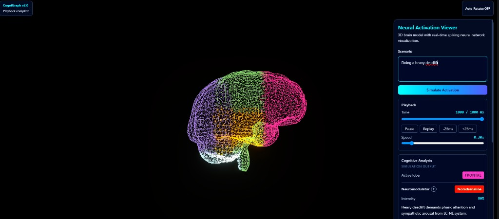
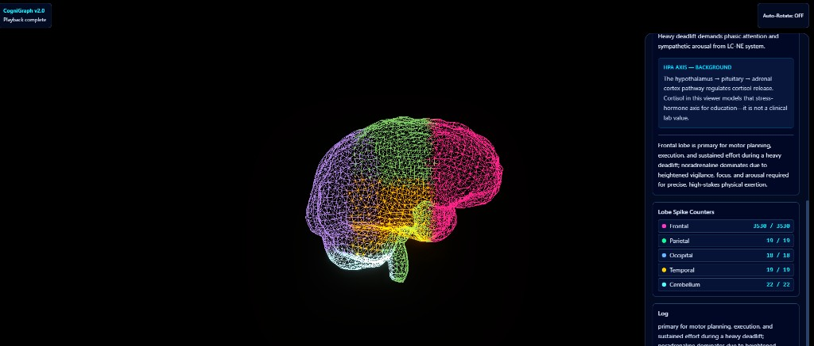

# CogniGraph

<p align="center">
  
</p>

**CogniGraph** (repository folder: `Cognigraph`) is a small educational demo: you describe a real-world scenario, an LLM classifies brain lobe and neuromodulator tone, a [Brian2](https://brian2.readthedocs.io/) spiking neural network (SNN) is simulated, and a web UI visualizes activity on a 3D brain model. The UI is a single page served from `/`; optional OpenRouter keys are entered only in the in-page **API Settings** panel (no separate auth route or redirect).

**This is not medical software.** Outputs are for visualization and learning only, not diagnosis or treatment. The UI includes context for modeled stress-hormone axes (for example HPA / cortisol) as simulation metaphors, not clinical measurements.

## Screenshots

**Neural Activation Viewer** — scenario input, playback controls, and cognitive analysis (example: *Doing a heavy deadlift*).

<p align="center">
  
</p>

**Simulation view** — colored lobe mesh, spike counters, HPA context, and event log after playback completes.

<p align="center">
  
</p>

## Requirements

- Python 3.10+ recommended (3.x required)
- pip

Brian2 may need a C compiler on some platforms for full performance; see the [Brian2 installation docs](https://brian2.readthedocs.io/en/stable/introduction/install.html).

## Setup

```bash
cd Cognigraph
python -m venv .venv
# Windows: .venv\Scripts\activate
# Unix: source .venv/bin/activate
pip install -r requirements.txt
```

## Configuration

1. Copy `.env.example` to `.env` in the project root.
2. Set `OPENROUTER_API_KEY` from [OpenRouter](https://openrouter.ai/).
3. Optionally set **`OPENROUTER_DEMO_MODEL`** (default: `qwen/qwen3.5-flash-02-23`) — used for **anonymous / no-browser-key** traffic on public demos, with a stronger educator-style system prompt. Alternatives: `openai/gpt-oss-120b`, or `openai/gpt-oss-120b:free` for a no-cost tier (rate limits apply). See [models](https://openrouter.ai/models).
4. Optionally set **`OPENROUTER_MODEL`** (default: `x-ai/grok-4.1-fast`) — used only when a visitor saves their **own** key in the UI (`X-OpenRouter-Api-Key`); they pay OpenRouter, not you.

Never commit `.env`; it is listed in `.gitignore`.

## Run

From the repository root (with dependencies installed):

```bash
python -m uvicorn backend.main:app --host 0.0.0.0 --port 8000 --reload
```

Then open [http://127.0.0.1:8000](http://127.0.0.1:8000).

**Windows:** double-click `start-cognigraph.bat`, or use `Baslat-Cognigraph.bat` for Turkish messages.

### Production-style local run

Use this command for production-like testing (no `--reload`):

```bash
python -m uvicorn backend.main:app --host 0.0.0.0 --port 8000
```

## Tests

```bash
pytest
```

Configuration: [`pytest.ini`](pytest.ini), tests under [`tests/`](tests/).

## API

| Method | Path | Description |
|--------|------|-------------|
| `GET` | `/` | Serves the web UI (`frontend/index.html`). |
| `GET` | `/healthz` | Lightweight health check endpoint for platform probes. |
| `POST` | `/simulate` | Runs classification + SNN + returns spikes and VFX echo. |

**`POST /simulate`** JSON body:

| Field | Type | Description |
|-------|------|-------------|
| `prompt` | string | Scenario text (1–1000 characters). |

Optional request headers (same origin as the UI; not required for the shared demo):

| Header | When | Description |
|--------|------|-------------|
| `X-OpenRouter-Api-Key` | BYOK | Visitor's OpenRouter key; billing on their account. |
| `X-OpenRouter-Model` | BYOK | OpenRouter model slug (e.g. `openai/gpt-4o`). Ignored without `X-OpenRouter-Api-Key`. Invalid values fall back to `OPENROUTER_MODEL`. |

**Response** (simplified): `active_lobe`, `dominant_neuromodulator`, `neuromodulator_intensity`, `neuromodulator_rationale`, `explanation`, `duration_ms`, `spikes` (per-lobe spike indices and times), `snn_modulation`, `vfx_profile`.

If `OPENROUTER_API_KEY` is missing, the API returns **503** with a clear message.

Static files are mounted at `/static` from the `frontend/` directory.

## Deploy

### Live deployments

- Vercel (production): [https://cognigraph-tau.vercel.app](https://cognigraph-tau.vercel.app)
- Fly.io (production): [https://cognigraph-13906.fly.dev](https://cognigraph-13906.fly.dev)

### Security model for API key

- Each user can provide their own OpenRouter key in the UI (`API Settings` panel).
- The key is stored in the user's browser local storage and sent as `X-OpenRouter-Api-Key`.
- Optional model id from the same panel is sent as `X-OpenRouter-Model` when a user key is present; if omitted or invalid, the server uses **`OPENROUTER_MODEL`**. Without a user key, `X-OpenRouter-Model` is ignored (shared traffic always uses **`OPENROUTER_DEMO_MODEL`**).
- Server-side env key (`OPENROUTER_API_KEY`) is still supported as fallback for visitors who do not add a key.
- Requests **without** `X-OpenRouter-Api-Key` use **`OPENROUTER_DEMO_MODEL`** (default `qwen/qwen3.5-flash-02-23`) plus a neuroscientist-educator system prompt; requests **with** a user key use **`OPENROUTER_MODEL`** or the validated `X-OpenRouter-Model` value (billing is on their OpenRouter account).
- For shared/public devices, users should clear their saved key after use.

### Vercel

1. Install CLI and login:
   ```bash
   npm i -g vercel
   vercel login
   ```
2. In project root, deploy:
   ```bash
   vercel
   ```
3. In Vercel dashboard, set env vars:
   - `OPENROUTER_API_KEY` (required)
   - `OPENROUTER_DEMO_MODEL` (optional; default is `qwen/qwen3.5-flash-02-23` for fast shared demo)
   - `OPENROUTER_MODEL` (optional; only affects users who add their own key in the UI)
4. Redeploy after env changes:
   ```bash
   vercel --prod
   ```

`vercel.json` routes all traffic to `src/index.py`, which re-exports the FastAPI `app` from `backend.main` (Vercel’s FastAPI detector expects paths like `src/index.py`, not `api/index.py`). We do **not** set `maxDuration` in `vercel.json`: Vercel only validates `functions` glob keys against the legacy **`api/`** directory, so patterns for `src/*.py` fail at build time. On **Vercel Pro**, open the project → **Settings** → **Functions** (or **Fluid compute** / duration controls, depending on UI) and raise the **maximum duration** for Python (aim for **60s** or more) so **`POST /simulate`** (often **15–25+ seconds** for OpenRouter + Brian2) does not 504. **Hobby** stays capped around **10 seconds** — use **Pro** or **Fly.io** for reliable `/simulate`.

### Fly.io

1. Install and auth:
   ```bash
   fly auth login
   ```
2. Create app (once) and deploy:
   ```bash
   fly launch --no-deploy
   fly deploy
   ```
3. Set secret key:
   ```bash
   fly secrets set OPENROUTER_API_KEY=your_key_here
   ```
4. Optional model overrides:
   ```bash
   fly secrets set OPENROUTER_DEMO_MODEL=qwen/qwen3.5-flash-02-23
   fly secrets set OPENROUTER_MODEL=x-ai/grok-4.1-fast
   ```
   Use **`OPENROUTER_DEMO_MODEL`** for the shared demo; **`OPENROUTER_MODEL`** only applies to BYOK requests.
5. Redeploy after secret/config changes:
   ```bash
   fly deploy
   ```

This repo includes `fly.toml` and `Dockerfile` configured for `uvicorn backend.main:app`.

## Deployment smoke tests

Run these checks against deployed URL (`$BASE_URL`):

```bash
curl -fsS "$BASE_URL/healthz"
curl -fsS "$BASE_URL/" > /dev/null
curl -sS -X POST "$BASE_URL/simulate" \
  -H "Content-Type: application/json" \
  -d "{\"prompt\":\"Solving a complex math problem\"}"
```

Expected behavior:
- `/healthz` returns `{"status":"ok"}`.
- `/` returns HTML.
- `/simulate` returns JSON with `active_lobe`, `dominant_neuromodulator`, `spikes`.
- If key is missing, `/simulate` returns `503` with key configuration hint.

## Recent Changes

- Shared demo traffic uses **`OPENROUTER_DEMO_MODEL`** (default Qwen 3.5 Flash + educator prompt); BYOK traffic uses **`OPENROUTER_MODEL`**.
- Security hardening in LLM error handling to avoid exposing sensitive upstream details to API clients.
- Faster request handling by reusing `httpx.AsyncClient` through FastAPI lifespan.
- SNN runtime optimization by removing repeated dictionary creation inside the `run_snn` loop.
- `build_vfx_profile` optimization by moving static profile definitions to module scope.
- Added test coverage for `_strip_markdown_fences`, `_load_dotenv_file`, `_lerp_toward_neutral`, `snn_params_to_dict`, payload length validation, and `GET /` (`serve_index`).

## Sharing (English copy)

Use this blurb when posting to LinkedIn, X, Reddit, or a blog. Replace `YOUR_REPO_URL` if you publish the source.

> **CogniGraph** — Describe a scenario; an LLM picks a brain lobe and neuromodulator tone; a Brian2 spiking network runs; a 3D brain visualizes the result. Live demo: https://cognigraph-tau.vercel.app — **Not medical software**; for learning and demos only.

Optional one-liner for tight character limits:

> Educational brain + SNN demo (LLM → Brian2 → 3D). Not clinical. https://cognigraph-tau.vercel.app

After sharing, smoke-test the live URL (`/healthz` and a sample `POST /simulate`) as described under [Deployment smoke tests](#deployment-smoke-tests). Without a configured key, `POST /simulate` should still return a clear JSON error about `OPENROUTER_API_KEY` rather than a generic failure — that confirms the route is live.

## License

This project is licensed under the MIT License — see [`LICENSE`](LICENSE).
